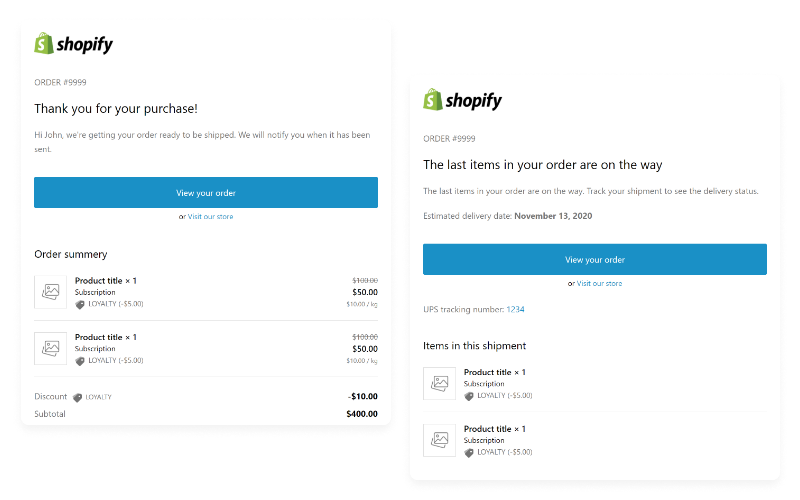

<!-- logo (start) -->
<p align="center">
  
</p>

<p align="center">
  
</p>
<!-- logo (end) -->

<!-- title / description (start) -->
<h2 align="center">Shopify Mail Notifications</h2>

Blazing-fast templating environment for Shopify mail notifications with Liquid, ✉ MJML + 🌿 Twig. Create responsive emails quickly with less code.
<!-- title / description (end) -->

<p align="center">
  
</p>

<!-- toc (start) -->
## Table of contents
- [Features](#features)
- [System requirements](#system-requirements)
- [Getting started](#getting-started)
- [Production](#production)
- [Directories](#directories)
- [Documentation](#documentation)
- [Limitations](#limitations)
<!-- toc (end) -->

<!-- features (start) -->
## Features
- MJML
- Twig
- Liquid
- Yaml
- Webpack
- Webpack-dev-server
- Ready to use shopify mail notification templates
<!-- features (end) -->

<!-- system requirements (start) -->
## System requirements
- Node.js
- npm or yarn
<!-- system requirements (end) -->

<!-- getting started (start) -->
## Getting started
Install dependencies and run webpack-dev-server:

### npm

```shell
$ npm install
```

```shell
$ npm run dev
```

### yarn

```shell
$ yarn import # migrate package-lock.json to yarn.lock
$ rm package-lock.json # or delete manually
$ yarn install --force
```

```shell
$ yarn dev
```

### Optional
If the server port is already in use, adjust `devServerPort` in `package.json`
<!-- getting started (end) -->

<!-- production (start) -->
## Production
Generate minified `.liquid` files in `dist/` directory:

### npm

```shell
$ npm run build
```

### yarn

```shell
$ yarn build
```
<!-- production (end) -->

<!-- directories (start) -->
## Directories
| Directory | Description |
| --- | --- |
| .config | Contains webpack configs. |
| src | Contains webpack's main entry point `main.js` which auto-loads all `.twig` files inside `src/templates/` and all subdirectories. |
| src/assets | Contains images (used only during development). |
| src/components | Contains reusable components. |
| src/data | Contains `.yml` files. The contents are accessible in all `.twig` files. |
| src/data/shopify | Contains `data.yml` file with Shopify dummy data (used during development to populate liquid templates). |
| src/layouts | Contains layouts. |
| src/templates | Contains mail templates. The `index.twig` template is reserved for navigation. |
<!-- directories (end) -->

<!-- documentation (start) -->
## Documentation

It's important to understand in which order webpack transforms the code. First, webpack compiles the `.twig` templates, then `MJML` tags are compiled to `html`. If the `build` task is running `liquid` isn't compiled and is written directly to the `dist/` directory as `.liquid` files. If the `dev` task is running: data from `src/data/shopify/` is passed to the liquid code, it's compiled to regular `html` and served via webpack-dev-server.

*Development flow*: `Twig` → `MJML` → `Shopify data` → `Liquid` → `.html files` → `Webpack-dev-server`

*Production flow*: `Twig` → `MJML` → `.liquid files`

### Additional notes
- Data from `src/data/` is available in all `.twig` templates.
- Data from `src/data/shopify/` is available during `liquid` compilation in development.
- If you want to write `liquid` tags instead of `twig` tags, you have to escape them with `` [about verbatim](https://twig.symfony.com/doc/2.x/tags/verbatim.html).
- You might get a Parsing error, especially when using the `<` character in `liquid` tags, use `<!-- htmlmin:ignore --><!-- htmlmin:ignore -->` for a fix.
- Some Shopify specific filters might not exist in the liquid compiler. To fix this for development, you can add additional filters to the `filter` section inside `.config/webpack.common.js`.

### Additional docs
- [MJML docs](https://documentation.mjml.io/)
- [Twig docs](https://twig.symfony.com/doc/2.x/)
- [Liquid docs](https://shopify.github.io/liquid/)
<!-- documentation (end) -->

<!-- limitations (start) -->
## Limitations
- If you change data in files inside `src/data/shopify/`, you have to restart webpack.
- It's not possible to set `shop.email_accent_color` to change it later in Shopify.
- `POS Exchange Receipt` template doesn't work.
<!-- limitations (end) -->